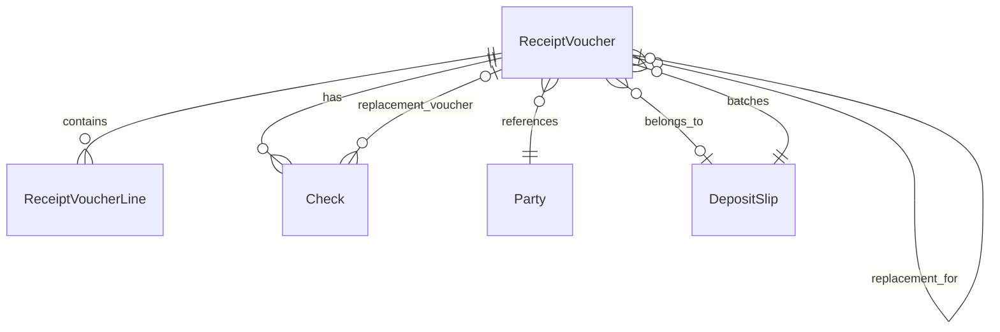

# Data Model: Receipt Voucher & Deposit Slip Workflow

**Date**: 2026-09-05
**Feature**: 017-receipt-voucher-deposit

## Entity Relationship Diagram



## Entities

### ReceiptVoucher

Represents a collection record from a party against outstanding revenue items.

| Field | Type | Constraints | Notes |
|-------|------|-------------|-------|
| `Id` | `int` | PK, Identity | |
| `VoucherNumber` | `string(20)` | UNIQUE, NOT NULL | Format: `RCV-{D6}`, generated at Draft creation |
| `VoucherDate` | `DateOnly` | NOT NULL | Collection date |
| `PartyId` | `int` | FK Parties, NOT NULL | Payer party reference |
| `PaymentMethod` | `int` | NOT NULL | 1=Cash, 2=Check (enum stored as int) |
| `ReceivedFrom` | `nvarchar(200)` | NOT NULL | Name of person/entity paying |
| `Notes` | `nvarchar(500)` | NULL | Optional notes |
| `DepositSlipId` | `int` | FK DepositSlip, NULL | Set when added to a slip |
| `Status` | `int` | NOT NULL | Draft=0, PendingReview=1, Approved=2, Cancelled=3 |
| `SubmittedById` | `int` | FK Users, NULL | User who submitted for review |
| `SubmittedAt` | `DateTimeOffset` | NULL | Submission timestamp |
| `ReviewedById` | `int` | FK Users, NULL | Reviewer who approved |
| `ReviewedAt` | `DateTimeOffset` | NULL | Review timestamp |
| `CancellationReason` | `nvarchar(500)` | NULL | Required if Status=Cancelled |
| `Created` | `DateTimeOffset` | NOT NULL | Audit: creation timestamp |
| `CreatedBy` | `string(128)` | NULL | Audit: creator identity |
| `LastModified` | `DateTimeOffset` | NOT NULL | Audit: last modification |
| `LastModifiedBy` | `string(128)` | NULL | Audit: last modifier identity |
| `RowVersion` | `byte[]` | NOT NULL | Optimistic concurrency token |

**Lifecycle**: `Draft → PendingReview → Approved → Cancelled`

**Business Rules**:
- VoucherNumber assigned at Draft creation (FR-001)
- Only PendingReview vouchers can be Approved (FR-016)
- Approval requires different user than submitter (reviewer gate)
- Cancelled vouchers cannot be reactivated
- DepositSlipId set when voucher is added to a slip; cleared when removed

---

### ReceiptVoucherLine

Individual line item on a receipt voucher, referencing an outstanding revenue item.

| Field | Type | Constraints | Notes |
|-------|------|-------------|-------|
| `Id` | `int` | PK, Identity | |
| `ReceiptVoucherId` | `int` | FK ReceiptVoucher, NOT NULL | Parent voucher |
| `RevenueAccountId` | `int` | FK Accounts, NOT NULL | Revenue item reference |
| `Amount` | `decimal(23,2)` | NOT NULL, > 0 | Payment amount |
| `Description` | `nvarchar(200)` | NULL | Optional line description |
| `Created` | `DateTimeOffset` | NOT NULL | Audit |
| `CreatedBy` | `string(128)` | NULL | Audit |
| `LastModified` | `DateTimeOffset` | NOT NULL | Audit |
| `LastModifiedBy` | `string(128)` | NULL | Audit |
| `RowVersion` | `byte[]` | NOT NULL | Optimistic concurrency |

**Business Rules**:
- Amount must be > 0
- Partial payment supported (Amount can be less than outstanding balance)
- RevenueAccountId must reference a valid account in the chart

---

### Check

Represents a check payment associated with a receipt voucher.

| Field | Type | Constraints | Notes |
|-------|------|-------------|-------|
| `Id` | `int` | PK, Identity | |
| `ReceiptVoucherId` | `int` | FK ReceiptVoucher, NOT NULL | Parent voucher |
| `BankName` | `nvarchar(100)` | NOT NULL | Bank name (not FK — delegated) |
| `CheckNumber` | `nvarchar(50)` | NOT NULL | Check number |
| `CheckDate` | `DateOnly` | NOT NULL | Date on check |
| `Amount` | `decimal(23,2)` | NOT NULL, > 0 | Check amount |
| `Status` | `int` | NOT NULL | UnderCollection=1, Cleared=2, Bounced=3 |
| `ClearedAt` | `DateTimeOffset` | NULL | When bank confirmed clearing |
| `BouncedAt` | `DateTimeOffset` | NULL | When bank reported bounce |
| `ReplacementVoucherId` | `int` | FK ReceiptVoucher, NULL | Links to replacement voucher if bounced |
| `Created` | `DateTimeOffset` | NOT NULL | Audit |
| `CreatedBy` | `string(128)` | NULL | Audit |
| `LastModified` | `DateTimeOffset` | NOT NULL | Audit |
| `LastModifiedBy` | `string(128)` | NULL | Audit |
| `RowVersion` | `byte[]` | NOT NULL | Optimistic concurrency |

**Lifecycle**: `UnderCollection → Cleared | Bounced`

**Business Rules**:
- BankName, CheckNumber, CheckDate required when PaymentMethod=Check (FR-004)
- Bounced checks create a new ReceiptVoucher for replacement payment
- ReplacementVoucherId links original bounced check to replacement

---

### DepositSlip

Batches approved vouchers for bank deposit.

| Field | Type | Constraints | Notes |
|-------|------|-------------|-------|
| `Id` | `int` | PK, Identity | |
| `SlipNumber` | `string(20)` | UNIQUE, NOT NULL | Format: `DSL-{D6}`, generated at creation |
| `SlipDate` | `DateOnly` | NOT NULL | Deposit date |
| `FormType` | `int` | NOT NULL | 47=Cash, 48=Checks |
| `Status` | `int` | NOT NULL | Draft=0, Approved=1 |
| `ApprovedById` | `int` | FK Users, NULL | Treasury manager who approved |
| `ApprovedAt` | `DateTimeOffset` | NULL | Approval timestamp |
| `TotalAmount` | `decimal(23,2)` | NOT NULL, >= 0 | Computed: sum of member voucher totals |
| `Created` | `DateTimeOffset` | NOT NULL | Audit |
| `CreatedBy` | `string(128)` | NULL | Audit |
| `LastModified` | `DateTimeOffset` | NOT NULL | Audit |
| `LastModifiedBy` | `string(128)` | NULL | Audit |
| `RowVersion` | `byte[]` | NOT NULL | Optimistic concurrency |

**Lifecycle**: `Draft → Approved`

**Business Rules**:
- FormType determines voucher homogeneity (FR-005)
- SlipDate must be >= latest member voucher date and <= today (FR-006)
- Form 47 approval triggers revenue recognition (FR-007)
- Form 48 approval moves checks to UnderCollection (FR-008)
- Only Treasury manager can approve (Separation of Duties)

---

## Enums

### ReceiptVoucherStatus (stored as int)

| Value | Name | Description |
|-------|------|-------------|
| 0 | Draft | Initial state, editable |
| 1 | PendingReview | Submitted for accounts review |
| 2 | Approved | Reviewed and approved, eligible for deposit |
| 3 | Cancelled | Cancelled with reason |

### PaymentMethod (stored as int)

| Value | Name | Description |
|-------|------|-------------|
| 1 | Cash | Cash payment |
| 2 | Check | Check payment |

### CheckStatus (stored as int)

| Value | Name | Description |
|-------|------|-------------|
| 1 | UnderCollection | Awaiting bank confirmation |
| 2 | Cleared | Bank confirmed — revenue recognized |
| 3 | Bounced | Bank rejected — voucher reopened |

### DepositSlipStatus (stored as int)

| Value | Name | Description |
|-------|------|-------------|
| 0 | Draft | Being assembled |
| 1 | Approved | Approved by treasury manager |

### FormType (stored as int)

| Value | Name | Description |
|-------|------|-------------|
| 47 | Form47 | Cash-only deposits |
| 48 | Form48 | Check-only deposits |

---

## Relationships

| From | To | FK | Cardinality | Notes |
|------|----|----|-------------|-------|
| ReceiptVoucher | Party | PartyId | Many-to-One | Required |
| ReceiptVoucher | DepositSlip | DepositSlipId | Many-to-One | Nullable |
| ReceiptVoucher | ReceiptVoucher | ReplacementVoucherId | Many-to-One | Nullable (bounced check) |
| ReceiptVoucherLine | ReceiptVoucher | ReceiptVoucherId | Many-to-One | Required |
| Check | ReceiptVoucher | ReceiptVoucherId | Many-to-One | Required |
| Check | ReceiptVoucher | ReplacementVoucherId | Many-to-One | Nullable |
| DepositSlip | (no FK) | — | — | Contains vouchers via ReceiptVoucher.DepositSlipId |

---

## Migration Strategy

### Phase 1: Create New Tables

```sql
CREATE TABLE ReceiptVouchers (
    Id INT IDENTITY PRIMARY KEY,
    VoucherNumber NVARCHAR(20) UNIQUE NOT NULL,
    VoucherDate DATE NOT NULL,
    PartyId INT NOT NULL FOREIGN KEY REFERENCES Parties(Id),
    PaymentMethod INT NOT NULL,
    ReceivedFrom NVARCHAR(200) NOT NULL,
    Notes NVARCHAR(500) NULL,
    DepositSlipId INT NULL FOREIGN KEY REFERENCES DepositSlips(Id),
    Status INT NOT NULL DEFAULT 0,
    SubmittedById INT NULL,
    SubmittedAt DATETIMEOFFSET NULL,
    ReviewedById INT NULL,
    ReviewedAt DATETIMEOFFSET NULL,
    CancellationReason NVARCHAR(500) NULL,
    Created DATETIMEOFFSET NOT NULL,
    CreatedBy NVARCHAR(128) NULL,
    LastModified DATETIMEOFFSET NOT NULL,
    LastModifiedBy NVARCHAR(128) NULL,
    RowVersion ROWVERSION NOT NULL
);

CREATE TABLE ReceiptVoucherLines (
    Id INT IDENTITY PRIMARY KEY,
    ReceiptVoucherId INT NOT NULL FOREIGN KEY REFERENCES ReceiptVouchers(Id),
    RevenueAccountId INT NOT NULL,
    Amount DECIMAL(23,2) NOT NULL CHECK (Amount > 0),
    Description NVARCHAR(200) NULL,
    Created DATETIMEOFFSET NOT NULL,
    CreatedBy NVARCHAR(128) NULL,
    LastModified DATETIMEOFFSET NOT NULL,
    LastModifiedBy NVARCHAR(128) NULL,
    RowVersion ROWVERSION NOT NULL
);

CREATE TABLE Checks (
    Id INT IDENTITY PRIMARY KEY,
    ReceiptVoucherId INT NOT NULL FOREIGN KEY REFERENCES ReceiptVouchers(Id),
    BankName NVARCHAR(100) NOT NULL,
    CheckNumber NVARCHAR(50) NOT NULL,
    CheckDate DATE NOT NULL,
    Amount DECIMAL(23,2) NOT NULL CHECK (Amount > 0),
    Status INT NOT NULL DEFAULT 1,
    ClearedAt DATETIMEOFFSET NULL,
    BouncedAt DATETIMEOFFSET NULL,
    ReplacementVoucherId INT NULL FOREIGN KEY REFERENCES ReceiptVouchers(Id),
    Created DATETIMEOFFSET NOT NULL,
    CreatedBy NVARCHAR(128) NULL,
    LastModified DATETIMEOFFSET NOT NULL,
    LastModifiedBy NVARCHAR(128) NULL,
    RowVersion ROWVERSION NOT NULL
);

CREATE TABLE DepositSlips (
    Id INT IDENTITY PRIMARY KEY,
    SlipNumber NVARCHAR(20) UNIQUE NOT NULL,
    SlipDate DATE NOT NULL,
    FormType INT NOT NULL,
    Status INT NOT NULL DEFAULT 0,
    ApprovedById INT NULL,
    ApprovedAt DATETIMEOFFSET NULL,
    TotalAmount DECIMAL(23,2) NOT NULL DEFAULT 0,
    Created DATETIMEOFFSET NOT NULL,
    CreatedBy NVARCHAR(128) NULL,
    LastModified DATETIMEOFFSET NOT NULL,
    LastModifiedBy NVARCHAR(128) NULL,
    RowVersion ROWVERSION NOT NULL
);
```

### Phase 2: Data Migration

```sql
-- Migrate RevenueReceipt → ReceiptVoucher
INSERT INTO ReceiptVouchers (
    VoucherNumber, VoucherDate, PartyId, PaymentMethod, ReceivedFrom,
    Notes, Status, Created, CreatedBy, LastModified, LastModifiedBy
)
SELECT
    'RCV-' + RIGHT('000000' + CAST(ROW_NUMBER() OVER (ORDER BY Id) AS VARCHAR), 6),
    ReceiptDate,
    -- Map PayerName to PartyId (requires party lookup)
    (SELECT TOP 1 Id FROM Parties WHERE NameAr = PayerName),
    CASE ReceiptType WHEN 0 THEN 1 WHEN 1 THEN 2 ELSE 1 END,
    PayerName,
    NULL,
    CASE Status WHEN 0 THEN 0 WHEN 1 THEN 2 WHEN 2 THEN 2 WHEN 3 THEN 3 ELSE 0 END,
    Created,
    CreatedBy,
    LastModified,
    LastModifiedBy
FROM RevenueReceipts;

-- Migrate RevenueReceiptLine → ReceiptVoucherLine
INSERT INTO ReceiptVoucherLines (
    ReceiptVoucherId, RevenueAccountId, Amount, Description,
    Created, CreatedBy, LastModified, LastModifiedBy
)
SELECT
    (SELECT Id FROM ReceiptVouchers WHERE VoucherNumber = 'RCV-' + RIGHT('000000' + CAST(ROW_NUMBER() OVER (ORDER BY rl.Id) AS VARCHAR), 6)),
    rl.AccountId,
    rl.Amount,
    rl.Description,
    rl.Created,
    rl.CreatedBy,
    rl.LastModified,
    rl.LastModifiedBy
FROM RevenueReceiptLines rl;
```

### Phase 3: Update Posting Rules

```sql
-- Add new event type
INSERT INTO EventTypes (Name, Code) VALUES ('ReceiptVoucherCollected', 12);

-- Update posting rules
UPDATE PostingRules
SET EventType = 'ReceiptVoucherCollected'
WHERE EventType = 'RevenueReceiptPosted';
```

### Phase 4: Drop Old Tables

```sql
DROP TABLE RevenueReceiptLines;
DROP TABLE RevenueReceipts;
```

---

## Indexes

```sql
-- ReceiptVoucher
CREATE UNIQUE INDEX IX_ReceiptVouchers_VoucherNumber ON ReceiptVouchers(VoucherNumber);
CREATE INDEX IX_ReceiptVouchers_PartyId ON ReceiptVouchers(PartyId);
CREATE INDEX IX_ReceiptVouchers_Status ON ReceiptVouchers(Status);
CREATE INDEX IX_ReceiptVouchers_DepositSlipId ON ReceiptVouchers(DepositSlipId) WHERE DepositSlipId IS NOT NULL;
CREATE INDEX IX_ReceiptVouchers_VoucherDate ON ReceiptVouchers(VoucherDate);

-- ReceiptVoucherLine
CREATE INDEX IX_ReceiptVoucherLines_ReceiptVoucherId ON ReceiptVoucherLines(ReceiptVoucherId);
CREATE INDEX IX_ReceiptVoucherLines_RevenueAccountId ON ReceiptVoucherLines(RevenueAccountId);

-- Check
CREATE INDEX IX_Checks_ReceiptVoucherId ON Checks(ReceiptVoucherId);
CREATE INDEX IX_Checks_Status ON Checks(Status);
CREATE INDEX IX_Checks_ReplacementVoucherId ON Checks(ReplacementVoucherId) WHERE ReplacementVoucherId IS NOT NULL;

-- DepositSlip
CREATE UNIQUE INDEX IX_DepositSlips_SlipNumber ON DepositSlips(SlipNumber);
CREATE INDEX IX_DepositSlips_Status ON DepositSlips(Status);
CREATE INDEX IX_DepositSlips_FormType ON DepositSlips(FormType);
CREATE INDEX IX_DepositSlips_SlipDate ON DepositSlips(SlipDate);
```
