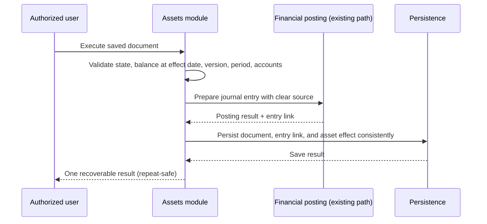
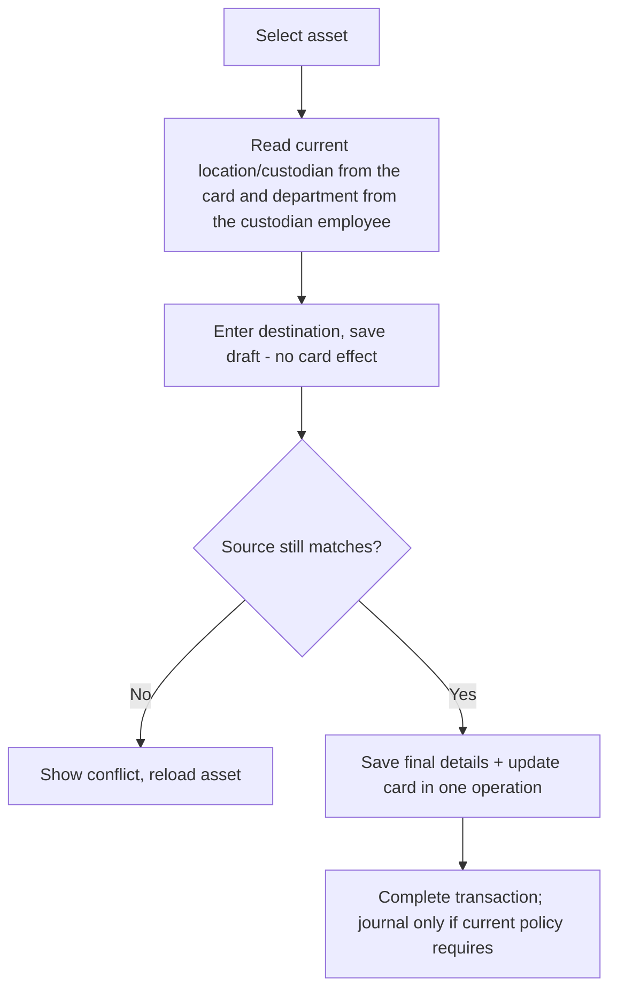
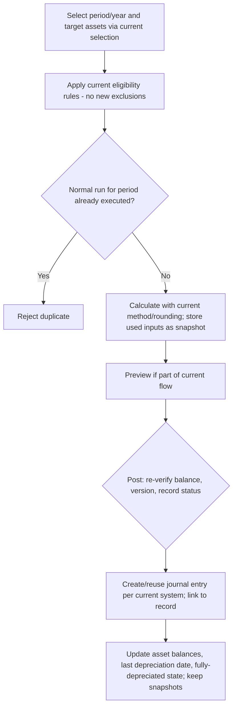
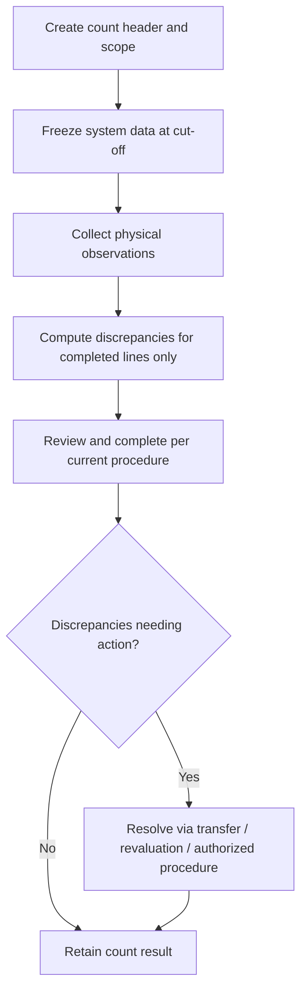

# Feature Specification: Asset Management Module (وحدة إدارة الأصول)

**Feature Branch**: `058-asset-module-spec`

**Created**: 2026-09-15

**Status**: Draft

**Input**: User description: "حوّل وثيقة `artifacts/asset-module-design-ar.md` والتصميم المكوّن من 13 جدولاً إلى مواصفة تنفيذية تشمل: نطاق العمل، الجداول والأعمدة والعلاقات، قواعد سلامة البيانات، حالات السجلات وانتقالاتها، قصص المستخدم مرتبة بالأولوية، تدفق العمليات، الصلاحيات، وسيناريوهات القبول Given/When/Then. النطاق: مجموعات الأصول، بطاقة الأصل، الخصائص المرنة، معاملات النقل والاستبعاد وإعادة التقييم وانخفاض القيمة، الإهلاك وعكسه، عكس انخفاض القيمة، الجرد ومراجعة الفروقات — مع الحفاظ على منطق العمل والحسابات والتقريب والترحيل والصلاحيات الحالية، وإعادة استخدام المراجع الموجودة، والحفاظ على البيانات والتاريخ المالي أثناء الانتقال."

## Clarifications

### Session 2026-09-15

- Q: Custodian scope and the asset's current-department source (design presumes an employee custodian; verified current code references **Users** via `Asset.CustodianId`; the card carries no department field) → A: Custody is restricted to **employees**: `Assets.EmployeeId` → `Employees` replaces the user-based custodian reference — an approved functional change limited to custodian scope and department source; no other behavior changes. The asset's current department is **derived from the custodian employee's `Employees.DepartmentId`**: no `DepartmentId` is added to the asset card, and the department is never derived from transfer records or location. If no custodian employee is set, or the employee has no department, the current department is unspecified. Transfer detail department fields remain **historical snapshots taken at execution time** and never change when the employee's department changes later; the displayed current department follows the custodian's current department. Legacy user-based custodianships migrate to employees via a **trusted, specific mapping** — no assumed `UserId`↔`EmployeeId` equivalence and no automatic name matching; unmappable cases MUST be surfaced for resolution before migration completes.
- Q: Unexamined count-line distinction (current model stores only `IsFound`/`IsMatch` booleans) → A: **Option C — `IsFound` becomes tri-state** (not examined / found / not found), an approved functional change to the existing field's semantics. Legacy boolean values map deterministically: `true` → found; legacy `false` is reclassified per the row's examination evidence (recorded physical observation/notes), and rows that cannot be classified confidently are surfaced for review — never silently reinterpreted. An unexamined line remains neither a match nor a confirmed loss, and completing a count requires no line left "not examined".
- Q: Aggregated depreciation posting linkage (current model links only schedule → entry via `JournalEntryId`; the design requires line-level traceability) → A: **Option B — aggregated journal entry + line-level source tagging**: posting MAY aggregate several assets into one journal entry, and each entry line carries source tagging linking it to the depreciation record it serves. Every schedule's share in the entry is determinable from the line-level linkage, and reports resolve the account from the tagged lines — never from an arbitrary first line.
- Q: When the four legacy asset documents (movement, disposal, revaluation, impairment) move into the unified `AssetTransactions` model, what happens to the legacy document tables and their stored history? (C1) → A: Custom — **delete and recreate**: drop the legacy assets-module tables and ALL their data and history entirely, then create the new design's tables empty. No record migration, no legacy/archive/compatibility tables, no migration mappings, no data copies. All read/write paths use the new design only, and programmatic references to the replaced tables are removed. The plan MUST explicitly list the tables to delete, the deletion order, and the referential handling. Deletion is scoped to the assets module only — shared tables and other modules' data (users, employees, accounts, journal entries, locations, funds, cost centers, currencies, fiscal periods) are untouched; any external reference that blocks deletion is listed explicitly for handling without automatically expanding the deletion scope. This supersedes the data-preservation requirements (including Q1's legacy custodian migration and Q2's legacy boolean mapping) and requires a numbered decision record under Constitution XII as a registered exception to Principle VI (financial records are not hard-deleted).
- Q: What is the distinct function of the separate legacy expense account versus the depreciation expense account in the new group model? (C5) → A: Custom — **one depreciation account field only**: the group keeps `DepreciationAccountId` (حساب الإهلاك). Removed from the new model: `DepreciationExpenseAccountId` (مصروف الإهلاك), `AccumulatedDepreciationAccountId` (مجمع الإهلاك), and `ExpenseAccountId` (المصروفات الإضافي) — these MUST NOT be automatically re-added. The decision concerns group **account setup fields only**: the asset's `AccumulatedDepreciation` balance value on the card is unaffected and remains. Sources of the remaining depreciation-entry accounts MUST be defined within the posting mechanism; where no defined source exists, the spec records **NEEDS CLARIFICATION** (FR-094a) — the single `DepreciationAccountId` MUST NOT be assumed to determine all sides of the depreciation entry.
- Q: Within the posting mechanism, what defines the account legs of the depreciation journal entry beyond the group's single `DepreciationAccountId`, given the seeded system template "قيد هلاك أصول" (JournalId=6, Recurring) carries no account lines today? (FR-094a / C5 follow-up) → A: **Option B — mixed account resolution**: the debit leg uses the group's `DepreciationAccountId` as the account charged with the depreciation amount (حساب تحميل مبلغ الإهلاك); the credit leg uses the accumulated depreciation account defined on the counterpart line inside the depreciation template — NOT added to AssetGroups; the template designates the substitution line by an explicit role, never by line order or account name; the actual accounts are saved in the entry lines at creation, and later changes to the group or template never alter previously created entries; posting is blocked when the group account is missing, the template is incomplete, the substitution role is undefined, or the entry is unbalanced; the template is identified by a trusted configuration reference — JournalId=6 is not assumed constant across environments; the substitution rule is an explicit implementation requirement — the current template's existence alone does not mean substitution is actually supported; the group keeps only `DepreciationAccountId`, and the depreciation expense / accumulated depreciation account fields are not re-added to it.
- Q: When a physical count document has a null location and/or department scope, what does that mean — entity-wide, mandatory, or informational? (FR-111) → A: **Option A — explicit all-scope semantics**: null location AND null department = a comprehensive count of the current entity's assets, explicitly displayed «جميع المواقع — جميع الإدارات»; location only = that location's assets regardless of department; department only = that department's assets regardless of location; both = assets matching location AND department. The department dimension resolves through the custodian employee (`Assets.EmployeeId` → `Employees.DepartmentId`). Department-unrestricted scopes include assets with no custodian or no department; department-restricted scopes exclude assets whose department membership cannot be proven. "All" is bounded to the current entity and permission boundaries — never all system entities; if permissions cannot cover the declared scope fully, no silent partial count is created under a comprehensive title. The scope and covered assets are fixed at count start/details generation — later location/department changes never rewrite the count's reference data. The scope is clearly shown on screen, document, and report, and lines are verified against it.
- Q: Within a single physical count, must each asset have exactly one observation line, or may an asset appear in multiple lines? (FR-116) → A: **Option A — one observation line per asset per count**: a UNIQUE constraint is enforced on (AssetPhysicalCountId, AssetId); each in-scope asset has exactly one line; re-examination during the count updates the same line and never creates an additional line; modifications are recorded in the immutable audit log with previous and new values, user, and timestamp; duplicate insertion is rejected and `RowVersion` prevents overwriting concurrent edits; discrepancies and count completion depend on the line's current result while the audit log retains previous observations; after count completion, the line is not modifiable through the normal re-examination path.

## Scope (نطاق العمل)

### In Scope

1. **Asset groups** (مجموعات الأصول): classification, default GL accounts, depreciation defaults, allowed/required flexible attributes.
2. **Asset card** (بطاقة الأصل): the current-state asset register record and its financial balances.
3. **Flexible attributes** (الخصائص المرنة): typed attribute definitions, group bindings, per-asset values.
4. **Asset transactions** for a single asset per document: **Transfer** (النقل), **Disposal** (الاستبعاد), **Revaluation** (إعادة التقييم), **Impairment** (انخفاض القيمة) — unified header + four specialized detail tables.
5. **Depreciation** (الإهلاك): calculation, posting, historical inputs, and **depreciation reversal** (عكس الإهلاك).
6. **Impairment reversal** (عكس انخفاض القيمة).
7. **Physical count** (الجرد) and **discrepancy review** (مراجعة الفروقات).
8. **Data reset and rebuild (حذف وإعادة إنشاء)**: legacy assets-module tables and ALL their data and history are dropped; the new 13-table model is created empty and fully operational; deletion is scoped to the assets module only, with shared tables and other modules' data untouched.

### Out of Scope (خارج النطاق)

- No mandatory approval/authorization cycle beyond what exists today.
- No new depreciation methods, no multiple asset books, no partial disposal.
- No new acquisition transaction type; acquisition continues through the existing path (procurement integration / opening balances).
- No new currency-conversion engine; existing FX machinery in the financial system is reused where it exists.
- No new audit platform; the existing audit/change log is reused.
- No new status enum numbering; existing status values are matched by meaning.
- No data migration, archives, compatibility tables, or migration mappings for legacy asset data — the legacy data is dropped, not carried forward (C1 decision).
- Physical count does not directly modify asset value, location, custodian, or status; discrepancies are resolved through the authorized operations.

## Documented Conflicts with Current Behavior (تعارضات موثقة)

The design document is code-independent. During specification, the current code was inspected. The conflicts below track where the proposed model differs from the current implementation. Resolved rows carry their decision. Unresolved rows preserve current **behavior** (logic, calculations, posting, permissions) in the new model until decided — legacy **data** is dropped per the C1 reset, so no conflict is resolved by retaining old rows.

| # | Design proposal | Current behavior (verified in code) | Required resolution |
|---|---|---|---|
| C1 | Unified `AssetTransactions` header + 4 detail tables | Separate documents: `AssetMovement` (transfer), `AssetDisposal`, `AssetRevaluation`, `AssetImpairment`, each with own number, `IsPosted`, `JournalEntryId`, `Notes` | **RESOLVED (custom answer, 2026-09-15)** — delete and recreate: legacy assets-module tables and all their data/history are dropped entirely; the new design's tables are created empty; no migration, archives, compatibility tables, or data copies; read/write paths move to the new design only; the plan lists the deletion scope, order, and referential handling; assets-module-only scope; requires a Constitution XII decision record (registered exception to VI); see FR-129…FR-133 |
| C2 | Do not store `NetProceeds`, `GainOrLoss`, `RevaluationAmount`, `RevaluationType`, `IsMatch` when fully computable | `AssetDisposal.NetProceeds/GainOrLoss`, `AssetRevaluation.RevaluationAmount/RevaluationType`, `AssetPhysicalCountDetail.IsMatch` are stored columns today | Keep the stored columns in the new model (preserves current behavior); removal remains a functional change requiring a recorded decision — no historical data remains to reconcile after the C1 reset |
| C3 | Custodian as employee (`EmployeeId` FK to employees) | `Asset.CustodianId` references **Users**, not employees | **RESOLVED (Q1, 2026-09-15)** — approved functional change: employee-only custody (`Assets.EmployeeId`), current department derived from the custodian employee's `Employees.DepartmentId` (no card field, never from transfers/location), legacy user custodians migrated via a trusted explicit mapping with unmappable cases surfaced first; see FR-038…FR-038c |
| C4 | `CurrencyId` integer FK on asset and transaction header | `CurrencyCode` (string) used on Asset, Disposal, Impairment, Revaluation, Movement, Count details | Mapping between currency code strings and currency records MUST be defined; no behavior change to amounts |
| C5 | Group accounts list of 6 + conditional `ExpenseAccountId` | Current group carries 7+ account fields: `AccountAssetId`, `AccountDepreciationId`, `AccountExpenseId`, `AccountAccumulatedDepreciationId`, `AccountDisposalId`, `AccountRevaluationId`, `AccountImpairmentId` (054 also exposed Gain/Loss on Disposal and Maintenance Expense accounts) | **RESOLVED (custom answer, 2026-09-15)** — the group keeps exactly ONE depreciation account field (`DepreciationAccountId`, حساب الإهلاك); `DepreciationExpenseAccountId`, `AccumulatedDepreciationAccountId`, and `ExpenseAccountId` are removed from the new model and MUST NOT be automatically re-added; the asset's `AccumulatedDepreciation` balance value is unaffected; the remaining depreciation-entry account legs are resolved by the depreciation template with a mixed substitution rule (FR-094a, Option B): debit = the group's `DepreciationAccountId`; credit = the template's accumulated-depreciation counterpart line, designated by an explicit role |
| C6 | `AssetTag`/`Barcode`/`SerialNumber` uniqueness not assumed | Spec 055 FR-009 enforces uniqueness on all three today | Preserve current uniqueness until a decision changes it; changing it is a functional change |
| C7 | Do not store `IsMatch`; do not treat "not inspected" as match/loss | `IsMatch` is a stored `bool`; no explicit inspection-state field exists | **RESOLVED (Q2: C, 2026-09-15)** — `IsFound` becomes tri-state (not examined / found / not found) as an approved functional change; stored `IsMatch` retention remains governed by conflict C2; see FR-114 |
| C8 | Reversal tracked via `ReversalOfId` links + status; `ReversalDate` derivable | Current entities store `IsReversed`, `ReversalOfId`, `ReversalReason`, `ReversalDate` | Keep all reversal fields (including `ReversalDate`, `IsReversed`) as stored today; derivation only after equivalence proven |
| C9 | `AssetMovement.MovementType` narrows to Transfer | `MovementType` is a free string and may include movement kinds other than transfer | **RESOLVED via C1 (2026-09-15)** — legacy movement data is dropped with its table; the new model defines the Transfer transaction type only; no mapping of other movement kinds is performed |

## User Scenarios & Testing *(mandatory)*

### User Story 1 - Configure Asset Groups with Default Accounts and Attributes (Priority: P1)

As an **asset configuration administrator (مسؤول إعدادات الأصول)**, I want to manage asset groups carrying default GL accounts, depreciation defaults, and allowed/required flexible attributes, so that every asset registered under a group inherits consistent defaults and every financial operation can resolve valid accounts.

**Why this priority**: Groups are the source of default accounts and depreciation parameters; without valid groups and accounts, no financial operation (depreciation, disposal, revaluation, impairment) can post. Group CRUD exists (054) over the old model; this story re-points it to the recreated group model and adds the attribute bindings.

**Independent Test**: Can be fully tested by creating a group with/without accounts and attribute bindings, then attempting to register an asset and execute a financial operation, verifying defaults flow and posting blocks when accounts are incomplete.

**Acceptance Scenarios**:

1. **Given** an authorized administrator, **When** they create a group with code, name, category, parent, depreciable flag, depreciation defaults, and default accounts, **Then** the group is saved uniquely-coded and selectable by its active state
2. **Given** a group hierarchy, **When** a user attempts to set a group's parent to itself or to any of its descendants (cycle), **Then** the save is rejected with a clear validation error
3. **Given** a group missing a required default account, **When** a financial operation under that group attempts to post, **Then** posting is blocked until all accounts needed by that operation are valid (configuration may remain incomplete with a warning at first asset linkage)
4. **Given** a posted operation exists, **When** an administrator later changes the group's default accounts, **Then** previously posted entries are not rewritten and remain traceable
5. **Given** a group with linked assets, **When** a user attempts to deactivate it, **Then** the deactivation is rejected (current rule) and group history is retained on any allowed deactivation
6. **Given** attribute definitions exist, **When** the administrator binds attributes to a group with required flag and sort order, **Then** the binding is saved with the group in one operation (composite identity: group + definition)

---

### User Story 2 - Register and Maintain the Asset Card with Flexible Attributes (Priority: P1)

As an **asset registrar (مسؤول سجل الأصول)**, I want to create and maintain asset cards (identification, references, financial values, dates, identifiers) and enter typed flexible attribute values, so that the register reflects each asset's current state and remains searchable by typed attributes.

**Why this priority**: The asset card is the anchor for every transaction and report. The register CRUD exists (055) over the old model; this story re-points it to the recreated card model, adds typed attributes, and locks in the clean-start rules for the fresh register.

**Independent Test**: Can be fully tested by creating an asset with attributes, changing its group, activating it, and verifying field locking, attribute typing, and concurrency behavior.

**Acceptance Scenarios**:

1. **Given** a registrar on the asset form, **When** they select a group, **Then** the group's defaults and allowed attributes are displayed with a clear distinction between defaults and asset-specific values
2. **Given** required group attributes are not filled, **When** the user saves/activates at the stage that enforces them, **Then** validation fails with field-level errors and user input is preserved
3. **Given** an attribute of type decimal exists, **When** a user enters a text value for it, **Then** the save is rejected with a type error (exactly one value column filled, matching the definition's data type; zero and false are real values, not blanks)
4. **Given** an asset holds attribute values, **When** its group is changed, **Then** existing values are retained and incompatible attributes are flagged for review — values are never deleted automatically
5. **Given** two users edit the same asset card, **When** the second save arrives, **Then** an optimistic-concurrency conflict is reported and no silent overwrite occurs
6. **Given** an activated asset, **When** the card is viewed, **Then** current values, dates, identifiers, status, and image link are shown as stored, including conditional fields retained per the design pending meaning confirmation

---

### User Story 3 - Transfer an Asset (نقل أصل) (Priority: P1)

As an **asset custodian administrator (مسؤول العهد)**, I want to transfer an asset to a new location, custodian, and/or department through a document that records the before/after values, so that the asset card reflects the destination while history preserves the source.

**Why this priority**: Transfers are the most frequent operational transaction and the model that defines how the unified transaction header works without a journal entry. It also exercises the conflict-revalidation and atomic card-update rules.

**Independent Test**: Can be fully tested by creating a transfer draft, executing it, re-transferring, and verifying card updates, history retention, and stale-source rejection.

**Acceptance Scenarios**:

1. **Given** an asset with current location/custodian/department, **When** the user opens a new transfer, **Then** the system pre-fills the "from" values from the asset card and the draft saves without any change to the asset
2. **Given** a transfer draft exists, **When** another user modifies the asset before execution, **Then** execution detects that the source no longer matches, shows the conflict, and requires a reload instead of overwriting silently
3. **Given** a valid transfer, **When** executed, **Then** the transfer record with final from/to values and occurrence time, and the asset card update (location and custodian employee; the displayed department follows the custodian employee's current department per FR-038a), are saved in one consistent operation
4. **Given** unchanged fields on the transfer, **When** saved, **Then** they carry their current values so that clearing the custodian (destination null, where allowed) is distinguishable from leaving it unchanged
5. **Given** an asset transferred multiple times, **When** its history is viewed, **Then** every transfer with its source and destination is retained
6. **Given** the current policy requires no journal entry for a transfer, **When** the transfer completes, **Then** the transaction is completed with no posted flag and no journal link

---

### User Story 4 - Run, Post, and Reverse Depreciation (الإهلاك وعكسه) (Priority: P1)

As an **asset accountant (محاسب الأصول)**, I want to calculate depreciation for a period using the current method and rounding rules, post it to the ledger, and reverse a posted depreciation record with full historical inputs preserved, so that asset balances, the ledger, and the depreciation history always agree.

**Why this priority**: Depreciation is the recurring financial engine of the module and the highest-volume posting path; correctness of historical inputs, duplicate prevention, and reversal semantics directly protect the financial system of record.

**Independent Test**: Can be fully tested by running a period for eligible assets, re-running it (must be blocked), posting, reversing one record, and reconciling stored amounts with the journal.

**Acceptance Scenarios**:

1. **Given** an open fiscal period and eligible depreciable assets, **When** the accountant runs depreciation, **Then** each produced record stores the calculation inputs used at that moment (method, base, rate, period data) as historical snapshots — later group changes never rewrite them
2. **Given** depreciation for a period was already executed normally for an asset, **When** the same normal run is attempted again, **Then** it is rejected as a duplicate; reversal and correction records are excluded from this rule
3. **Given** a depreciation run is posted, **When** posting completes, **Then** the journal entry (created or reused per current system behavior) is linked to each schedule record and the asset balances, last-depreciation date, and fully-depreciated state are updated in the same consistent operation
4. **Given** several assets post in one aggregated journal entry, **When** a record is traced later, **Then** each schedule's share in the entry is determinable from the line-level source tagging linking every entry line to the record it serves — reports never pick an arbitrary first line
5. **Given** a posted depreciation record, **When** an authorized user reverses it with a reason and date, **Then** a reversal record linked via the reversal link is created with its own journal entry built from the original entry's accounts (not the group's current accounts), and the original record and its entry remain untouched
6. **Given** a depreciation reversal completed, **When** the asset card is viewed, **Then** the last effective depreciation date and fully-depreciated state are recomputed per the current rule, not merely flipped from the journal status
7. **Given** amounts stored at six-decimal precision, **When** posted, **Then** the posted amount matches the journal entry and the current rounding policy (storage precision does not introduce currency fractions that the policy does not allow)

---

### User Story 5 - Dispose of an Asset (استبعاد أصل) (Priority: P1)

As an **asset administrator with posting authorization**, I want to dispose of an asset (sale, donation, damage, or another current method) through a document that snapshots the book value and accumulated depreciation at the disposal date, so that the disposal is traceable, the gain/loss is derived per the current policy, and the asset's history is never erased.

**Why this priority**: Disposal ends an asset's financial life and is audit-critical; it must produce correct snapshots and a linked journal entry while preventing both double disposal and history deletion.

**Independent Test**: Can be fully tested by disposing of an asset with proceeds and costs, verifying computed net proceeds/gain-loss, the asset's status transition, the linked entry, and the rejection of a second disposal.

**Acceptance Scenarios**:

1. **Given** an asset eligible for disposal, **When** the user selects the method and date, **Then** the system determines the correct book value and accumulated depreciation as of the disposal date (not the current balance copied blindly for a retrospective date)
2. **Given** a sale disposal, **When** the user enters sale proceeds and/or disposal costs and buyer data, **Then** net proceeds and gain/loss are derived per current definitions and displayed without being recomputed from live card data after the fact
3. **Given** a completed disposal, **When** executed, **Then** the journal entry is posted, linked to the document, and the asset's status transitions per the current disposal rule — the card, document, and historical values all remain
4. **Given** an already-disposed asset, **When** another disposal is attempted, **Then** it is rejected as a duplicate
5. **Given** a disposal document, **When** viewed, **Then** no disposal account is chosen on the details — the group default selected at posting and the actual accounts in the journal lines are the only account sources
6. **Given** a disposal attempt with mixed currencies between proceeds and book value, **When** validated, **Then** it is rejected — amounts compared in one computation share one currency basis

---

### User Story 6 - Revalue an Asset (إعادة تقييم) (Priority: P2)

As an **appraisal administrator**, I want to record a revaluation with the previous book value determined at the effect date, the approved new value, and appraiser/report references, so that the value change, its direction, and the posting that produced it remain traceable.

**Why this priority**: Revaluation changes the value basis and is less frequent than transfers/depreciation, but it directly drives card balances and must not be reconstructable wrongly from the live card.

**Independent Test**: Can be fully tested by posting an increase and a decrease revaluation and verifying computed amount/direction, card update, and historical retention.

**Acceptance Scenarios**:

1. **Given** an asset and an effect date, **When** the user opens a revaluation, **Then** the system determines the previous book value correct at that date and accepts the approved new value as input
2. **Given** old and new values, **When** displayed, **Then** the difference and its direction are computed (positive increase, negative decrease, zero no-difference) and zero is never classified as an increase
3. **Given** a revaluation accepted by the current policy, **When** posted, **Then** the journal entry per current revaluation rules is linked and the card balance is updated to match that effect in the same consistent operation
4. **Given** a posted revaluation, **When** viewed later, **Then** old/new values, appraiser, and report number remain as historical snapshots regardless of later changes

---

### User Story 7 - Recognize and Reverse Impairment (انخفاض القيمة وعكسه) (Priority: P2)

As an **asset accountant**, I want to record an impairment with carrying amount, recoverable amount, loss, and assessment references, and to reverse a posted impairment with a reason through a linked reversal document, so that the correction path preserves the original and never deletes history.

**Why this priority**: Impairment and its reversal are correction-critical but less frequent than the core lifecycle operations; they depend on the unified transaction model and reversal machinery.

**Independent Test**: Can be fully tested by posting an impairment, reversing it, and verifying links, reasons, journal entries, and card effects.

**Acceptance Scenarios**:

1. **Given** an asset and assessment data, **When** the user creates the impairment, **Then** carrying amount, recoverable amount, loss amount with its current sign convention, reason, description, assessor, and report number are stored as the historical record
2. **Given** a posted impairment, **When** an authorized user reverses it with a reason and date, **Then** a new impairment-kind transaction is created linked to the original via the reversal link, with its own journal entry built from the original entry's accounts
3. **Given** a reversal attempt, **When** the target is self-linked or would create a reversal cycle, or a conflicting reversal already exists, **Then** it is rejected per the current reversal rules
4. **Given** a completed reversal, **When** the original document is viewed, **Then** the original keeps its journal and its status reflects the reversal per current statuses; a draft reversal record alone never cancels the original's effect
5. **Given** a later revaluation-driven recovery (استرداد انخفاض القيمة), **When** recorded, **Then** it is NOT performed by re-labeling the reversal mechanism — the current treatment applies unchanged

---

### User Story 8 - Conduct Physical Count and Review Discrepancies (الجرد ومراجعة الفروقات) (Priority: P2)

As a **count administrator (مسؤول الجرد)**, I want to create a count document scoped by location/department, freeze system data at the cut-off, record actual observations, and review computed discrepancies, so that the count is a historical comparison document that never silently mutates asset data.

**Why this priority**: The count protects register integrity and feeds corrections, but it is a comparison workflow; its value depends entirely on trustworthy cut-off snapshots and honest observation entry.

**Independent Test**: Can be fully tested by creating a count, generating details at cut-off, entering observations including a not-found asset, and verifying discrepancy display and card immutability.

**Acceptance Scenarios**:

1. **Given** a count draft, **When** the scope (location/department/type/date, counters) is set, **Then** the header saves without requiring a counter until the stage that requires one
2. **Given** an approved cut-off point, **When** details are generated for in-scope assets, **Then** the `System*` fields are frozen at that point and are never refreshed by reopening the screen
3. **Given** a detail line, **When** the observer records the physical location/custodian/status and found-result, **Then** physical fields are never auto-filled from system values — an unfilled physical field is not treated as a match
4. **Given** lines recorded as tri-state (not examined / found / not found), **When** discrepancies are displayed, **Then** they are computed from the stored system vs physical comparison for examined lines only, and a not-examined line is neither a match nor a confirmed loss
5. **Given** a completed count with discrepancies, **When** resolved, **Then** resolution happens only through authorized operations (transfer for location, revaluation/assessment for damage, current procedure for loss) — the count itself never updates the card
6. **Given** an asset found during the count that is not registered, **When** handled, **Then** it is processed per the current procedure outside these details (registering it directly is a separate extension, not in scope)
7. **Given** a count with at least one line still "not examined", **When** completion is attempted, **Then** completion is blocked until every included line has a definite state (found or not found)
8. **Given** a count created with null location and null department, **When** viewed on screen, document, or report, **Then** the scope is explicitly labeled «جميع المواقع — جميع الإدارات» and covers the current entity's register within the creator's permission boundaries — assets with no custodian or no department are included; if the permissions cannot cover the declared scope fully, creation is blocked rather than producing a silent partial "comprehensive" count
9. **Given** an asset already has an observation line in an active count, **When** it is re-examined during the count, **Then** the same line is updated (duplicate insertion rejected; `RowVersion` guards concurrent edits), the change is recorded in the immutable audit log with previous/new values, user, and timestamp, and after the count completes the line is no longer editable through the normal re-examination path

---

### User Story 9 - Trace an Asset's Complete Financial and Operational History (Priority: P2)

As an **auditor (المراجع)**, I want to view, from the asset card, every transaction, depreciation record, and count occurrence with their dates, statuses, linked journal entries, the accounts actually used in those entries' lines, and reversal links, so that every reported figure traces to its originating document and journal entry.

**Why this priority**: Traceability is the audit guarantee the module promises; it reads only already-stored links but must present them correctly (line-level account attribution, reversal pairing, as-of-date semantics).

**Independent Test**: Can be fully tested by executing a transfer, depreciation, reversal, and disposal on one asset, then verifying the history view shows each with correct links and that as-of-date reports treat reversal dates correctly.

**Acceptance Scenarios**:

1. **Given** an asset with operations, **When** the history is viewed, **Then** each operation shows its document, date, status, and journal entry link
2. **Given** a posted operation reversed later, **When** an "as of date" report runs, **Then** the original appears in periods before the reversal date and the reversal appears from its own date — the original is never hidden from history
3. **Given** an aggregated posting, **When** the account actually used for an asset is queried, **Then** it comes from the entry's line(s) attributed to that asset's schedule, never from a guessed first line
4. **Given** a reversal record, **When** viewed, **Then** the link to the original record/document and the reversal reason are displayed, and the original remains fully preserved

---

### Edge Cases

- What happens when a transaction is dated retrospectively? → The correct asset balance as of the effect date is determined before snapshots are written; the current balance is never copied blindly for a retrospective date.
- What happens when two users execute the same document simultaneously? → Optimistic concurrency on header, details, and asset card detects the conflict; one execution succeeds and a repeated request returns the same consistent result without a second effect (duplicate execution MUST be impossible).
- What happens when a required group account is invalid at posting time? → Posting is blocked with an explicit error; accounts may be incomplete during configuration only.
- What happens when an attribute's stored column does not match the definition's data type? → Save-path cross-table validation rejects it; exactly one value column is filled per value row.
- What happens when the fiscal period is closed or the period does not belong to the selected fiscal year? → Posting is rejected per the current fiscal-period rules.
- What happens when a reversal is attempted on an already-reversed operation? → Rejected per the current reversal rules; no double reversal of the same effect.
- What happens when disposal proceeds currency differs from the asset/transaction currency? → Rejected; no cross-currency arithmetic is allowed and no FX engine is introduced by this feature.
- What happens when the asset is fully depreciated but still in use? → Fully-depreciated does not stop usage; `IsFullyDepreciated` and status follow their current, independent rules.
- What happens when a count re-counts the same asset (re-count rounds)? → If re-counts are separate records, the count/asset uniqueness is not enforced without designing count cycles (decision recorded before enforcement).
- What happens when an included asset is examined and not found? → The line records "not found"; it is a count discrepancy only — loss never triggers an automatic disposal, and resolution follows the current authorized procedure.
- What happens when a document number cannot be generated? → No partial document is created; the failure is returned consistently.
- What happens when a user edits the financial content of a posted operation? → Rejected; corrections use the existing reversal mechanism where supported.

## Process Flows (تدفق العمليات)

### Financial posting backbone (shared by disposal, revaluation, impairment, depreciation posting)

Responsibilities only — transaction boundaries follow the existing integration mechanism; if entry posting is separated from asset persistence, the existing integration must guarantee both effects or neither, and success is shown to the user only after the consistent result is reached.

### Transfer

### Depreciation run

### Physical count

## Record States and Transitions (حالات السجلات وانتقالاتها)

Descriptive names only — existing status values/enum numbers are matched by meaning and never renumbered.

### Asset transaction (النقل/الاستبعاد/إعادة التقييم/انخفاض القيمة)

| State | Meaning | Data effect |
|---|---|---|
| Draft (مسودة) | Editable, not executed | No effect on asset or ledger |
| Completed (مكتملة) | Executed per its type | Transfer applied or financial operation posted |
| Cancelled (ملغاة) | Stopped before execution | No financial or operational effect |
| Reversed (معكوسة) | A linked reversal executed where the type supports it | Original history preserved; counter effect recorded |

| Transaction state/type | IsPosted | JournalEntryId |
|---|---|---|
| Draft, not posted | false | may be empty (a linked draft entry is not posting) |
| Completed transfer without financial effect | false | empty |
| Completed transfer requiring an entry per current policy | true | posted entry |
| Completed disposal / revaluation / impairment | true | posted entry |
| Financial operation later reversed | true | original entry remains linked |

### Depreciation record

| State | Meaning |
|---|---|
| Draft/Calculated (مسودة/محسوب) | Calculated not yet posted, if the current flow stores previews |
| Posted ( مرحل) | Entry and asset effect fixed |
| Reversed (معكوس) | Original record reversed; kept in history |
| Cancelled (ملغى) | Unposted record stopped |

The reversal record has its own status and entry. `IsReversed`/`ReversalDate` are kept as stored today; collapsing them into status is only considered after full-equivalence proof.

### Physical count

| State | Meaning |
|---|---|
| Draft (مسودة) | Scope and counters being defined |
| In progress (جارٍ) | Cut-off reference fixed; observations being collected |
| Completed (مكتمل) | Entry finished per completion conditions |
| Cancelled (ملغى) | Incomplete document stopped per current policy |

`ReviewedById` presence does not imply an "approved" state; review follows the current procedure (no mandatory review approval is added).

### Asset

Operational statuses (draft/inactive, in use, disposed) match the existing list — no new list. Full depreciation does not stop usage; deactivating the record is not an accounting disposal.

## Requirements *(mandatory)*

### Functional Requirements

**Scope & model**

- **FR-001**: System MUST implement the asset data model as 13 tables: AssetGroups, Assets, AssetTransactions, AssetTransferDetails, AssetDisposalDetails, AssetRevaluationDetails, AssetImpairmentDetails, DepreciationSchedules, AssetPhysicalCounts, AssetPhysicalCountDetails, AssetAttributeDefinitions, AssetGroupAttributes, AssetAttributeValues — reusing existing chart-of-accounts, journal entries, currencies, employees/users, locations, departments, funds, cost centers, fiscal years/periods, identity, document sequences, and audit tables rather than duplicating them.
- **FR-002**: System MUST keep asset operations single-asset per transaction (all four types) and multi-asset only inside a count document; any existing batch execution creates/processes individual records per the current mechanism.
- **FR-003**: System MUST NOT introduce an approval cycle, new depreciation methods, multiple books, partial disposal, or an acquisition transaction type.

**Asset groups**

- **FR-010**: AssetGroups MUST carry: code (unique), name, description, parent group, default accounts — asset, ONE depreciation account (`DepreciationAccountId`, حساب الإهلاك, per C5), disposal, revaluation, impairment loss — depreciation method/rate/default useful life, depreciable flag, category, active flag. `DepreciationExpenseAccountId`, `AccumulatedDepreciationAccountId`, and `ExpenseAccountId` are REMOVED from the new group model (C5) and MUST NOT be re-added automatically (Constitution VI explicit precision preserved on the remaining fields).
- **FR-011**: Group hierarchy MUST reject self-parentage and cycles and MUST keep the current maximum-depth rule.
- **FR-012**: Deactivating a group MUST NOT erase its history, and MUST follow the current rule regarding groups with linked assets.
- **FR-013**: Changing a default account MUST NOT rewrite any previously posted entry; the account actually posted is preserved in journal lines.
- **FR-014**: Group accounts MAY be incomplete during configuration; any account required by a financial operation MUST be validated as postable at posting time (Constitution IV).

**Flexible attributes**

- **FR-020**: Attribute definitions MUST support data type (text, integer, decimal, date, boolean), unit of measure, active flag, and default sort order; deactivation MUST NOT delete prior values.
- **FR-021**: Changing an attribute's data type while values exist MUST be blocked unless an explicit, approved conversion path is executed.
- **FR-022**: Group-attribute bindings MUST use the composite identity (group, definition) with required flag and optional group-level sort order (absent order falls back to the definition's default; absent order never reorders historical data).
- **FR-023**: Attribute values MUST store exactly one filled value column matching the definition's type, enforced by cross-table validation in the save path (Constitution III — server-side enforcement).
- **FR-024**: Attribute values MUST be unique per (asset, definition); zero and false MUST be treated as real values, not blanks.
- **FR-025**: No value row MUST be created for an optional attribute left unentered.
- **FR-026**: Changing an asset's group (or removing a used attribute from a group) MUST retain existing values and present incompatible ones for review — no automatic deletion.

**Asset card**

- **FR-030**: The asset card MUST retain all current fields and capacities, including conditional legacy fields (`OriginalValue`, `RelinquishmentValue`, `IsActive`) which MUST NOT be dropped or merged until their meanings are confirmed (Constitution VI).
- **FR-031**: Asset codes MUST remain unique within the entity's numbering scope, generated server-side via the existing document sequence service, preserving current prefix/format capacity.
- **FR-032**: `CurrentValue` MUST NOT be an independently hand-editable field once balances are authoritative; it changes only through executed operations per current rules.
- **FR-033**: The system MUST NOT assume `CurrentValue = AcquisitionCost - AccumulatedDepreciation` when revaluations, impairments, or other operations exist; card values are the current-state summary, not a rebuildable invariant without opening balances and full history.
- **FR-034**: Asset status transitions MUST follow the currently allowed paths only.
- **FR-035**: On any depreciation reversal, the last effective depreciation date and fully-depreciated state MUST be recomputed per the current rule.
- **FR-036**: Depreciation start date rules and activation requirements MUST follow the current policy unchanged.
- **FR-037**: Each monetary amount MUST carry exactly one currency (asset card currency; transaction header currency) with no cross-currency arithmetic (Constitution IV).
- **FR-038**: Custody MUST be restricted to employees: `Assets.EmployeeId` (FK to employees) replaces the current user-based custodian reference across the card, transfer details (`FromEmployeeId`/`ToEmployeeId`), and count details (`SystemEmployeeId`/`PhysicalEmployeeId`) — approved functional change scoped to custodian scope and department source only.
- **FR-038a**: The asset's current department MUST be derived from the custodian employee's `Employees.DepartmentId`; no `DepartmentId` column MUST be added to the asset card; the department MUST NOT be derived from transfer records or location. An unspecified custodian, or a custodian employee without a department, means the current department is unspecified.
- **FR-038b**: Transfer detail department values MUST remain historical snapshots taken at execution time; they MUST NOT change when the employee's department changes later, while the displayed current department follows the custodian's current department.
- **FR-038c**: No legacy custodian migration is performed — legacy asset data is dropped per the C1 decision; custody is employee-only from the clean start (Q1), and any user→employee mapping work is out of scope.
- **FR-039**: The card and its attribute values MUST be saved in one operation, updating the card's concurrency token; group-attribute bindings are saved with the group in one operation.

**Unified transaction header & details**

- **FR-040**: `AssetTransactions` MUST store: number (preserving current document-number capacity and format), asset, type (1 transfer, 2 disposal, 3 revaluation, 4 impairment), date (effect date per current policy), status, currency, journal entry link, posted flag, optional external reference (type/id, no generic FK), and notes.
- **FR-041**: A completed transaction MUST have exactly one detail record, and only in the detail table matching its type; drafts may wait for details, and execution MUST be blocked until details are complete (exclusivity rule enforced explicitly, not implied by four optional relations).
- **FR-042**: Saving a draft MUST NOT change the asset's balances, location, custodian, or ledger (Constitution III — no effect before execution).
- **FR-043**: Status describes the execution lifecycle and the posted flag describes accounting posting; if the current status already encodes both exactly, the flag MAY be computed instead of stored after the meaning is confirmed (conditional field rule).
- **FR-044**: Transaction numbering MUST follow the current numbering policy and the existing document-sequence service for new documents from the clean start; where types use independent sequences, uniqueness is (type, number) within the entity's range.
- **FR-045**: Financial content of posted transactions MUST NOT be edited; correction uses the existing reversal mechanism where supported (Constitution IV).

**Transfer details**

- **FR-050**: Transfer details MUST record occurrence time, from/to location, from/to custodian, from/to department; unchanged fields are filled with their current values (so removal vs unchanged is distinguishable without new flags).
- **FR-051**: A null destination MUST mean an intentional final clearing (where unassignment is allowed by current rules), never "no change".
- **FR-052**: Execution MUST re-validate that source data still matches the asset; a stale draft MUST be reloaded, never silently overwritten (Concurrency rule FR-121).
- **FR-053**: The transfer record and the card update MUST be one consistent operation; historical transfers MUST never be lost on subsequent transfers.

**Disposal details**

- **FR-060**: Disposal details MUST record: method (current methods only), book value at disposal, accumulated depreciation at disposal (historical snapshots), sale proceeds and disposal cost where applicable, buyer name/contact where applicable.
- **FR-061**: `NetProceeds` and `GainOrLoss` MUST derive for display from `SaleProceeds - DisposalCost` and `NetProceeds - BookValueAtDisposal`; the currently stored columns MUST be kept and maintained consistent with their current derivation until a removal decision is recorded (conflict C2).
- **FR-062**: No disposal account on the details: the group default is selected at posting and the actual account is in the journal lines.
- **FR-063**: A completed disposal MUST leave the card, the document, and its historical values in place; the asset status transitions per the current disposal rule; screen-level deletion to hide the operation MUST be impossible (Constitution VI).
- **FR-064**: A second disposal of the same asset MUST be rejected per current duplicate rules.

**Revaluation details**

- **FR-070**: Revaluation details MUST record: method (current values; required-at-completion per current requirements), old book value, new book value (one currency basis), appraiser, report number.
- **FR-071**: `RevaluationAmount` (new − old) and direction (increase/decrease/no-difference) MUST be computed; zero difference MUST NOT be auto-classified as an increase, and accepting a no-effect operation follows the current policy (conflict C2 storage rule applies).
- **FR-072**: The details alone MUST NOT determine how the revaluation effect distributes over accounts or accumulated depreciation; journal lines carry the actual effect and current revaluation rules update the card.

**Impairment details**

- **FR-080**: Impairment details MUST record: carrying amount, recoverable amount, loss amount (sign interpretation fixed once in the implementation map per the current convention), reason, description, assessor, report number, optional reversal link (`ReversalOfTransactionId`, same asset, impairment type), and reversal reason.
- **FR-081**: Reversal links MUST reject self-reference and cycles; the reversal date is the reversal transaction's own date (not duplicated on details).
- **FR-082**: The original impairment MUST keep its journal; the reversal carries its own counter-entry; the original's status reflects the reversal per current statuses — a draft reversal record alone MUST NOT cancel the original's effect.
- **FR-083**: Reversal here means correcting the operation per current behavior; a later-assessment recovery of impairment MUST NOT be implemented by re-labeling the reversal mechanism.

**Depreciation**

- **FR-090**: Each depreciation record MUST store: asset, date, fiscal year (and period where applicable — period must belong to the selected year), used method, base, rate (historical snapshots), period number/total periods (conditional fields retained as currently used), amount, accumulated depreciation after operation, net book value after operation (snapshots), status, journal link, reversal link, reversal reason/date (all reversal fields kept as stored today, conflict C8).
- **FR-091**: The stored amount MUST match what is posted for that asset; six-decimal storage MUST NOT introduce currency fractions beyond the current rounding policy (Constitution IV).
- **FR-092**: Displaying an old record MUST present the method/inputs used at the time (stored), never the group's current method presented as historical.
- **FR-093**: Posted records MUST NOT be deleted or rewritten to regenerate a schedule; no standalone future-projection table is introduced by this feature.
- **FR-094**: Duplicate prevention for the normal run MUST key on current-period identity and record nature; a simple unique constraint on (asset, period) MUST NOT be used because it blocks reversals/corrections and the period is optional. Normal-run duplication for the same period remains forbidden per current rules. When posting aggregates several assets into one journal entry, every entry line MUST carry source tagging linking it to the depreciation record it serves (Q3: B) — each record's share in the entry is traceable at line level.
- **FR-094a**: The depreciation journal entry's accounts MUST be resolved by the depreciation accounting template with a mixed substitution rule (Option B, 2026-09-15): the **debit leg** MUST use the group's `DepreciationAccountId` as the account charged with the depreciation amount (حساب تحميل مبلغ الإهلاك); the **credit leg** MUST use the accumulated depreciation account defined on the counterpart line inside the depreciation template — that account is NOT added to AssetGroups. The template MUST designate the substitution line by an **explicit role** — never by line order or account name. At entry creation the actual accounts MUST be saved in the entry lines; later changes to the group or the template MUST NOT alter previously created entries. Posting MUST be blocked when the group account is missing, the template is incomplete, the substitution role is undefined, or the entry is unbalanced. The template MUST be identified by a trusted configuration reference — the currently seeded JournalId=6 MUST NOT be assumed constant across environments. The substitution rule is an explicit implementation requirement: the existing template's presence alone does NOT mean substitution is supported today — the mechanism MUST be built as part of this feature. The group keeps ONLY `DepreciationAccountId` for depreciation setup; `DepreciationExpenseAccountId` and `AccumulatedDepreciationAccountId` MUST NOT be re-added (C5).
- **FR-095**: Fiscal year/period consistency MUST be validated (period belongs to the selected year) and posting gates (period open/unlocked) follow the current rules (Constitution IV).

**Reversals (depreciation & impairment)**

- **FR-100**: A reversal MUST create a counter record (depreciation: new schedule via reversal link; impairment: new impairment-kind transaction via `ReversalOfTransactionId`) with its own journal entry built from the ORIGINAL entry's accounts and links — never from the group's currently configured accounts.
- **FR-101**: The original operation and its entry MUST remain; the reversal never replaces or deletes them (Constitution IV).
- **FR-102**: Balance computations MUST include each effect exactly once — an operation excluded from aggregation MUST NOT also have its reversal subtracted again (double-count prevention).
- **FR-103**: The reversal amount sign convention MUST follow the single existing convention (signed amount or absolute with reversal semantics) fixed in the implementation map; mixing conventions in aggregation MUST be blocked.
- **FR-104**: Reversal support boundaries follow current behavior: disposal/revaluation reversal is NOT introduced by this feature if it does not exist today.

**Physical count**

- **FR-110**: Count header MUST record: number (unique per current numbering), reference date, location and department scope, type, status, started/completed timestamps, counter, reviewer, notes (current capacities preserved).
- **FR-111**: Count scope MUST follow explicit semantics (Option A, 2026-09-15): null location AND null department = a comprehensive count of the current entity's assets, explicitly displayed «جميع المواقع — جميع الإدارات»; location only = assets of that location regardless of department; department only = assets of that department regardless of location; both specified = assets matching location AND department. The department dimension resolves through the custodian employee (`Assets.EmployeeId` → `Employees.DepartmentId`, FR-038a). Department-unrestricted scopes include assets with no custodian or no department; a department-restricted scope excludes assets whose department membership cannot be proven.
- **FR-111a**: "All" scope MUST remain bounded to the current entity and the creator's permission boundaries — never all entities of the system. If permissions do not allow covering the declared scope fully, the system MUST NOT silently create a partial count under a comprehensive title.
- **FR-111b**: The document's scope and the assets it covers MUST be fixed when the count starts and its details are generated; later changes to an asset's location or the custodian employee's department MUST NOT rewrite the count's reference data (cut-off snapshot rule, FR-112). The scope MUST be displayed clearly on screen, document, and report, and generated lines MUST be verifiable against it.
- **FR-112**: `System*` detail fields MUST be snapshotted at the count's defined cut-off point and MUST NOT be refreshed on screen reopen.
- **FR-113**: Physical observation fields MUST NEVER be auto-filled from system values.
- **FR-114**: `IsFound` MUST be tri-state (not examined / found / not found) — approved functional change (Q2: C) applied from the clean start; no legacy count data exists to map (dropped per the C1 reset). Match results MUST NOT be newly computed-and-stored beyond current behavior (stored `IsMatch` retention per conflict C2); a not-examined line is neither a match nor a confirmed loss, and completing a count MUST require every included line to have a definite state (found or not found).
- **FR-115**: Count details MUST cover registered assets only (asset reference required); an unregistered physically-found asset follows the current procedure outside these details.
- **FR-116**: A UNIQUE constraint MUST be enforced on (AssetPhysicalCountId, AssetId) (Option A, 2026-09-15): every asset included in a count has exactly ONE observation line. Re-examination during the count MUST update the same line — never create an additional line — and every such modification MUST be recorded in the immutable audit log with the previous value, the new value, the user, and the timestamp (Constitution VIII). Duplicate insertion MUST be rejected, and `RowVersion` MUST prevent overwriting a concurrent edit (FR-121). Discrepancy computation and count completion depend on the line's current result; the audit log retains previous observations. After the count completes, the line MUST NOT be modifiable through the normal re-examination path.
- **FR-117**: The count document MUST NOT modify asset value, location, custodian, or status; discrepancy resolution uses the authorized operations only.
- **FR-118**: Allowing no counter at draft creation MUST NOT exempt the stage that requires one; no mandatory reviewer approval is added beyond current procedure.

**Execution consistency, idempotency, concurrency**

- **FR-120**: Successful execution MUST persist ALL related effects (document state, journal entry link, asset card effect, snapshots) as one consistent result; a failure MUST NOT leave a posted entry with an un-updated card, an updated card without its entry, or a half-applied reversal (Constitution IV).
- **FR-121**: Every update MUST verify the concurrency token of the header AND the asset card; a conflicting concurrent edit MUST be reported explicitly with no partial write (Constitution VI/IX).
- **FR-122**: Repeating an execution request (retry, double-submit) MUST return the same consistent result without repeating the financial effect (idempotent completion) (Constitution XIII).
- **FR-123**: Before finalizing historical snapshots for a retrospective-dated transaction, the correct balance at the effect date MUST be determined; copying the current balance is forbidden when it misrepresents that date.
- **FR-124**: The account actually posted MUST be discoverable from the linked entry's lines (with role/source attribution); reports MUST NOT pick the first account line arbitrarily.
- **FR-125**: If accounts or balances changed between preview and execution, execution MUST re-validate per current behavior; group-account display before execution follows the current screen requirements.
- **FR-126**: Modifying details requires the header's concurrency token and updates the header in the same operation; if execution allows independent detail/value edits, each gets independent auditing and concurrency protection.

**Data reset and rebuild (حذف وإعادة إنشاء — قرار C1)**

- **FR-129**: Dropping legacy financial records deviates from Constitution Principle VI (financial and audit records are not hard-deleted); the C1 decision MUST be registered as a numbered decision record with owner, rationale, scope, and remediation path before implementation (Constitution XII).
- **FR-130**: The legacy assets-module tables and ALL their data and history MUST be dropped entirely, and the new design's 13 tables MUST be created empty — no record migration, no legacy/archive/compatibility tables, no migration mappings, and no copies of old data. The implementation plan MUST explicitly list every table in scope for deletion, the deletion order, and the referential handling.
- **FR-131**: Deletion scope MUST be limited to the assets module's tables: shared tables and other modules' data — users, employees, chart of accounts, journal entries, locations, funds, cost centers, currencies, fiscal years/periods — MUST NOT be deleted or modified beyond removing references to the dropped tables. Journal entries produced by legacy asset operations remain in the ledger; any source references they carry to dropped asset records MUST be listed in the plan for explicit handling. Any external reference that blocks deletion MUST be listed explicitly and resolved without automatically expanding the deletion scope.
- **FR-132**: All read/write paths MUST use the new design only, and programmatic references to the replaced tables MUST be removed; no compatibility views or bridges may be introduced.
- **FR-133**: The new model MUST start empty and be fully operational from the clean state: groups, register, transactions, depreciation, counts, and attributes are all usable with no legacy rows.
- **FR-134**: Foreign keys to accounts, assets, and posted transactions MUST use Restrict (no cascade deletes that erase history) (Constitution VI).
- **FR-135**: User identity references MUST match the existing identity key type; never assumed to be an integer or a specific string format.
- **FR-136**: The drop-and-recreate schema changes MUST ship as versioned, reviewable migrations; runtime auto-DDL is prohibited (Constitution VI).

**Permissions & authorization**

- **FR-140**: Every asset operation endpoint AND its backing use case MUST declare a named permission; authorization MUST fail closed and record grants/denials in the security audit log (Constitution VII).
- **FR-141**: Permissions MUST preserve the existing set (`AssetGroups.View/Create/Update/Deactivate/Activate`, `Assets.View/Create/Update`) and extend it per operation, proposed mapping: transfers `Assets.Transfers.Create`/`Assets.Transfers.Execute`; disposals `Assets.Disposals.Create`/`Assets.Disposals.Execute`; revaluations `Assets.Revaluations.Create`/`Assets.Revaluations.Execute`; impairments `Assets.Impairments.Create`/`Assets.Impairments.Execute`; depreciation `Assets.Depreciation.Run`/`Assets.Depreciation.Execute`/`Assets.Depreciation.Reverse`; impairment reversal `Assets.Impairments.Reverse`; counts `Assets.Counts.Create`/`Assets.Counts.Execute`/`Assets.Counts.Review`. Exact names MUST match the current naming convention at plan time.
- **FR-142**: Data preparation (creating a disposal/revaluation/impairment document) and financial execution (posting) MAY be separate permissions where the current system separates them; the same user MAY hold both per current assignment.
- **FR-143**: Reversal authorization MUST follow the current system's reversal permissions; no new approval stages are added.
- **FR-144**: Navigation entries for all new screens MUST carry their required permission identifier matching backend policy naming (Constitution X).

**Audit, records, UI**

- **FR-150**: Main tables (groups, assets, transactions, depreciation records, count header, count details, attribute definitions) MUST carry the shared audit pattern: concurrency token (RowVersion), created/created-by, last-modified/last-modified-by, matching the existing identity types and the current policy for nullable user fields on automated/imported records (Constitution VI/VIII).
- **FR-151**: Audit of last-modification reuses the existing audit/change log; it does not replace a full change history where one is required; audit trails remain insert-only (Constitution VIII).
- **FR-152**: All screens MUST be Arabic-first RTL, render correctly in dark mode, use the shared component library and design tokens, and render money through the shared money-display conventions (Constitution X).
- **FR-153**: Errors MUST follow the unified error contract: stable codes, safe Arabic messages, field targets, correct HTTP semantics (409 for state/concurrency conflicts) (Constitution XIII).

### Key Entities *(include if feature involves data)*

Proposed target model (13 tables), created empty per the C1 reset. `?` = nullable; conditional fields marked ⚠️ are included in the new model until their meanings are confirmed. `int` fields for statuses/methods carry the existing constrained values.

**1. AssetGroups (مجموعات الأصول)** — classification + defaults.

| Field | Notes |
|---|---|
| Id (PK), Code (unique), Name (required), Description? | identity |
| ParentAssetGroupId? (FK self) | hierarchy; no cycles |
| AssetAccountId?, DepreciationAccountId? (حساب الإهلاك — the single depreciation account, per C5), DisposalAccountId?, RevaluationAccountId?, ImpairmentLossAccountId? | FK to chart of accounts; removed per C5 and not auto re-added: DepreciationExpenseAccountId, ExpenseAccountId, AccumulatedDepreciationAccountId |
| DepreciationMethod (current values), DepreciationRate? decimal(18,4), DefaultUsefulLifeYears?, ResidualValuePercentage? decimal(5,2) ⚠️conditional | current interpretation rules |
| IsDepreciable, AssetCategory, IsActive | category has constrained current values |

**2. Assets (الأصول)** — current card: Code (unique), Name, Description?, AssetGroupId (FK), LocationId?, FundId?, CostCenterId?, EmployeeId? (FK to employees — approved custodian change per Q1), CurrencyId (FK, maps current currency code, C4), AssetTag?, Barcode?, SerialNumber? (uniqueness per C6 current rule), ImageUrl? (kept until replacement proven), OriginalValue ⚠️, AcquisitionCost, ResidualValue?, RelinquishmentValue? ⚠️, AccumulatedDepreciation, CurrentValue?, PurchaseDate?, ActivationDate?, DepreciationStartDate?, LastDepreciationDate?, Status, AcquisitionType, UsefulLifeYears?, IsFullyDepreciated, IsActive? ⚠️, Notes? (capacity preserved). Current department is derived (not stored): from the custodian employee's `Employees.DepartmentId` (FR-038a).

**3. AssetTransactions (معاملات الأصول)** — unified header: Id (PK), TransactionNumber, AssetId (FK), TransactionType (1/2/3/4), TransactionDate, Status, CurrencyId (FK), JournalEntryId?, IsPosted, ReferenceType?, ReferenceId?, Notes?. Audit columns. Uniqueness per FR-044.

**4. AssetTransferDetails (تفاصيل النقل)** — PK/FK AssetTransactionId (transfer type only), OccurredAt (datetime, movement time preserved), FromLocationId?, ToLocationId?, FromEmployeeId?/ToEmployeeId? (FK to employees, FR-038), FromDepartmentId?, ToDepartmentId? (historical snapshots at execution, FR-038b).

**5. AssetDisposalDetails (تفاصيل الاستبعاد)** — PK/FK AssetTransactionId (disposal only), DisposalMethod (current values), BookValueAtDisposal decimal(23,2), AccumulatedDepreciationAtDisposal decimal(23,2), SaleProceeds?, DisposalCost?, BuyerName?, BuyerContact?. Stored NetProceeds/GainOrLoss per FR-061 (C2). No disposal account here.

**6. AssetRevaluationDetails (تفاصيل إعادة التقييم)** — PK/FK AssetTransactionId (revaluation only), RevaluationMethod?, OldBookValue decimal(23,2), NewBookValue decimal(23,2), Appraiser?, AppraisalReportNumber?. Stored RevaluationAmount/Type per FR-071 (C2).

**7. AssetImpairmentDetails (تفاصيل انخفاض القيمة)** — PK/FK AssetTransactionId (impairment only), CarryingAmount decimal(23,2), RecoverableAmount decimal(23,2), ImpairmentLoss decimal(23,2) (sign per current convention), ImpairmentReason?, ImpairmentDescription?, AssessedBy?, AssessmentReportNumber?, ReversalOfTransactionId? (FK to AssetTransactions; same asset, impairment type), ReversalReason?.

**8. DepreciationSchedules (سجلات الإهلاك)** — Id (PK), AssetId (FK), DepreciationDate, FiscalYearId?, FiscalPeriodId? (must belong to the year), DepreciationMethod?, DepreciationBase? decimal(23,6), DepreciationRate? decimal(18,4), PeriodNumber? ⚠️, TotalPeriods? ⚠️, Amount decimal(23,6), AccumulatedDepreciation decimal(23,6), NetBookValue decimal(23,6), Status (current values), JournalEntryId? (aggregated entries permitted; each entry line carries source tagging linking it to the record it serves — Q3: B), ReversalOfId? (FK self, same asset), ReversalReason?, ReversalDate? (kept, C8). No separate forecast table.

**9. AssetPhysicalCounts (رأس الجرد)** — Id (PK), CountNumber (unique), CountDate, LocationId?, DepartmentId?, CountType, Status, StartedAt?, CompletedAt?, CountedById?, ReviewedById? (approved reference), Notes?. Scope semantics per FR-111/FR-111a/FR-111b (null+null = entity-wide «جميع المواقع — جميع الإدارات», bounded by the current entity + permissions); the department dimension resolves via the custodian employee's department (FR-038a).

**10. AssetPhysicalCountDetails (تفاصيل الجرد)** — Id (PK), AssetPhysicalCountId (FK), AssetId (FK), SystemLocationId?, PhysicalLocationId?, SystemEmployeeId?/PhysicalEmployeeId? (FK to employees, FR-038), SystemStatus?, PhysicalStatus?, IsFound (tri-state: not examined / found / not found — approved change Q2: C, FR-114), IsMatch (stored per C2 pending decision), DiscrepancyNotes?. UNIQUE (AssetPhysicalCountId, AssetId) per FR-116 — one observation line per asset per count; re-examination updates the line in place with audit-tracked changes.

**11. AssetAttributeDefinitions (تعريف خصائص الأصل)** — Id (PK), Code (unique), Name, Description?, DataType (1 text/2 int/3 decimal/4 date/5 boolean), Unit?, IsActive, SortOrder.

**12. AssetGroupAttributes (خصائص المجموعة)** — composite PK (AssetGroupId, AssetAttributeDefinitionId), IsRequired, SortOrder? (absent → definition default; zero is a real order).

**13. AssetAttributeValues (قيم خصائص الأصل)** — Id (PK), AssetId (FK), AssetAttributeDefinitionId (FK), TextValue? nvarchar(1000), IntegerValue?, DecimalValue? decimal(18,4), DateValue?, BooleanValue?. Unique (AssetId, AssetAttributeDefinitionId); exactly one filled column per row.

**Internal relations (العلاقات الداخلية)**

| Parent | Child reference | Cardinality |
|---|---|---|
| AssetGroups.Id | AssetGroups.ParentAssetGroupId | 0..1 parent, many children |
| AssetGroups.Id | Assets.AssetGroupId | 1 → many |
| Assets.Id | AssetTransactions.AssetId | 1 → many |
| AssetTransactions.Id | each of the 4 detail tables (PK/FK) | 0..1 per matching type; exclusivity enforced (FR-041) |
| AssetTransactions.Id | AssetImpairmentDetails.ReversalOfTransactionId | optional reversal link |
| Assets.Id | DepreciationSchedules.AssetId | 1 → many |
| DepreciationSchedules.Id | DepreciationSchedules.ReversalOfId | optional reversal link (same asset) |
| AssetPhysicalCounts.Id | AssetPhysicalCountDetails.AssetPhysicalCountId | 1 → many |
| Assets.Id | AssetPhysicalCountDetails.AssetId | asset appears in many counts |
| AssetGroups.Id × AssetAttributeDefinitions.Id | AssetGroupAttributes (composite PK) | many-to-many with attributes |
| Assets.Id × AssetAttributeDefinitions.Id | AssetAttributeValues | 1 value per (asset, definition) |

**External references (reused, not new tables)**: chart of accounts (group defaults; entry lines), journal entries (entry links; line-level source tagging for aggregated depreciation postings per Q3: B), locations, **employees** (custodian — restricted per Q1 decision; also source of the asset's current department via `Employees.DepartmentId`), departments (transfers + count scope), funds, cost centers, currencies (C4 mapping), fiscal years/periods, users/identity (audit + counter/reviewer), document sequences, existing audit log.

**Indexes (candidate, per query needs)**: `(AssetId, TransactionDate, Id)` on transactions; `(AssetId, DepreciationDate, Id)` on depreciation; count-header FK index on details; reversal-link and journal-link indexes as needed. Deletion: drafts may be deleted only if that is the current policy; cancellation-with-retention follows current behavior.

## Success Criteria *(mandatory)*

### Measurable Outcomes

- **SC-001**: Every legacy assets-module table on the plan's explicit deletion list is fully dropped (data and history) and the new 13-table model is created empty — verified by a deletion report covering each listed table and by zero changes to shared/other-module tables (users, employees, accounts, journal entries reconcile unchanged).
- **SC-002**: The new model is fully operational from the empty state: a complete lifecycle (group setup → asset registration with attributes → transfer → depreciation run/post/reverse → disposal → revaluation → impairment and reversal → physical count with discrepancies) executes successfully on the clean register in verification tests.
- **SC-003**: 0 of the attempted duplicate executions (depreciation re-run, second disposal, repeated document execution) produce a second financial or operational effect in verification tests.
- **SC-004**: 100% of concurrent-edit conflicts on documents, details, and asset cards are detected and reported (no silent overwrites), verified by concurrent-edit tests.
- **SC-005**: Every executed financial operation leaves document, journal entry, and asset card mutually consistent — 0 inconsistent triples in functional tests executing against a real database.
- **SC-006**: Every posted amount is traceable within one interaction: from asset card → transaction → journal entry → the line-level account actually used; auditors can resolve the account for 100% of sampled postings without guessing.
- **SC-007**: As-of-date reporting treats effects correctly: an operation appears in periods before its reversal date, and the reversal appears from its own date — 0 instances of double-subtraction or erased history in report tests.
- **SC-008**: A user registers a complete asset card with attributes in under 3 minutes, and executes a transfer draft in under 1 minute (task-time measurement with typical data).
- **SC-009**: A 500-line count document renders its discrepancy view in under 5 seconds with typical data.
- **SC-010**: All new screens pass Arabic-first RTL and dark-mode rendering checks with zero layout defects in acceptance review.

## Assumptions

- **Existing foundation**: Asset groups CRUD (054) and asset register CRUD (055) are delivered; their screens are re-pointed to the recreated model rather than rebuilt, and the register starts empty per the C1 decision.
- **Clean-slate data decision (C1)**: legacy assets-module data and history are dropped — business logic (calculations, rounding, posting, permissions, status rules) is preserved while data is not; this deviation from Constitution VI requires a numbered decision record before implementation (FR-129).
- **Reused references**: chart of accounts, journal entries and their lines, currencies, employees (custodian per the Q1 decision) and users (identity/audit), locations, departments, funds, cost centers, fiscal years/periods, identity/user key type, document sequence service, and the existing audit log are reused as-is. The custodian restriction to employees and the derived-department rule are the only approved functional changes of the Q1 decision; no other behavior changes.
- **Calculation logic unchanged**: depreciation calculation, rounding, depreciation start-date determination, period closure checks, and posting gates follow the current policy exactly; any change is a separate functional decision.
- **Statuses matched by meaning**: descriptive state names in this spec map to the current status values; enum numbers are not replaced.
- **Currency basis**: each amount carries one currency (today's behavior, string codes mapped to currency records per C4); no FX conversion or multi-currency transaction support is introduced; if transaction currency differing from asset currency must be supported, that is a separate incomplete decision, not silently enabled here.
- **Conditional fields retained**: all fields flagged conditional (including stored computed values per C2) are included in the new model — empty — until their meanings are confirmed; no behavior change is presumed. Exception (C5): the group account setup fields `DepreciationExpenseAccountId`, `AccumulatedDepreciationAccountId`, and `ExpenseAccountId` are removed, not retained.
- **Batch execution**: if batch depreciation execution exists today, it produces individual records per the current mechanism; this spec does not redesign batching.
- **No localization exceptions**: Arabic-first RTL and the design system apply to all new screens; monetary display uses shared conventions.
- **Dependencies**: existing posting path to the general ledger (including the established event/integration mechanism), fiscal period open/unlocked gates, document number generation, and optimistic-concurrency round-trip are available and unchanged.
